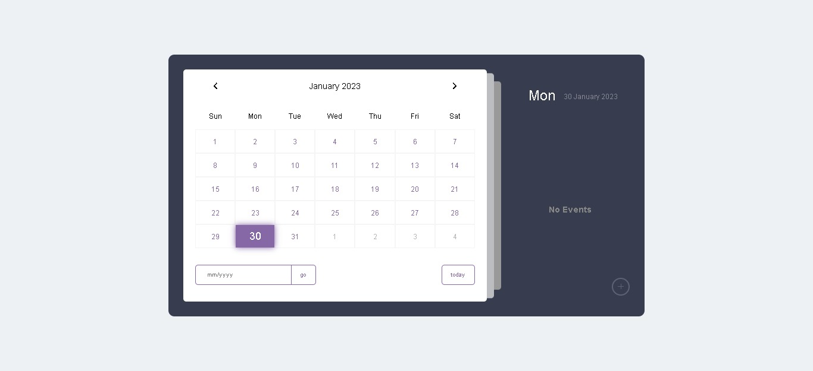

# Calender

This App was built to practice working with Dates, it is a Responsive dynamic Calender with an events lists.
I built this following along with this [tutorial](https://www.youtube.com/watch?v=r1devGCrm2Y) and tried to adjust the design a little more

## Overview

### The challenge

Users should be able to:

- traverse through the calender with all the years and monthes
- add events to the days that they want
- events added will be save in the localStorage

### Screenshot

### Links

- [Live Site URL](https://husamasaad.github.io/dynamic-calender/)

## My process

### Built with

- Semantic HTML5 markup
- CSS custom properties
- Flexbox
- CSS Grid
- Ec6

## Author

- github Profile - [Husam Asaad](https://github.com/husamasaad)

## Acknowledgment

All the Thanks to [Open Source Coding](https://www.youtube.com/watch?v=r1devGCrm2Y) Channel.
